# 智能菜谱管理平台

## 项目文档

---

**项目名称**：智能菜谱管理平台（Smart Recipe Management Platform）

**技术方向**：企业级应用方向

**开 发 者**：（请填写姓名学号）

**完成日期**：2026年7月

---

## 目录

- [一、需求分析](#一需求分析)
  - [1.1 项目背景](#11-项目背景)
  - [1.2 功能需求](#12-功能需求)
  - [1.3 非功能需求](#13-非功能需求)
  - [1.4 用例分析](#14-用例分析)
- [二、概要设计](#二概要设计)
  - [2.1 系统架构设计](#21-系统架构设计)
  - [2.2 模块划分](#22-模块划分)
  - [2.3 技术选型](#23-技术选型)
- [三、详细设计](#三详细设计)
  - [3.1 数据库设计](#31-数据库设计)
  - [3.2 接口设计](#32-接口设计)
  - [3.3 核心流程设计](#33-核心流程设计)
  - [3.4 前端页面设计](#34-前端页面设计)
- [四、系统实现](#四系统实现)
  - [4.1 开发环境](#41-开发环境)
  - [4.2 项目结构](#42-项目结构)
  - [4.3 核心代码说明](#43-核心代码说明)
  - [4.4 关键配置](#44-关键配置)
- [五、系统测试](#五系统测试)
  - [5.1 测试环境](#51-测试环境)
  - [5.2 功能测试](#52-功能测试)
  - [5.3 测试结果](#53-测试结果)
- [六、项目分工](#六项目分工)

---

## 一、需求分析

### 1.1 项目背景

随着人们生活水平的提高和健康意识的增强，越来越多的人开始关注日常饮食的营养搭配和烹饪管理。然而，传统的纸质菜谱和备忘录方式存在以下问题：菜谱管理不便、食材采购容易遗漏、营养摄入难以量化、膳食计划缺乏系统性。

智能菜谱管理平台旨在通过数字化手段解决上述问题，为用户提供一站式的菜谱管理、膳食计划、购物清单和营养统计服务，帮助用户实现科学饮食、健康生活的目标。

### 1.2 功能需求

#### 1.2.1 用户认证模块

系统需要提供完整的用户认证功能，保障用户数据安全。

- **用户注册**：用户可通过用户名、密码注册账号，支持填写昵称、邮箱、手机号、性别等基本信息。
- **用户登录**：已注册用户可通过用户名和密码登录系统，登录成功后获取JWT令牌。
- **令牌认证**：系统采用JWT（JSON Web Token）进行无状态认证，令牌有效期为24小时。
- **信息修改**：用户可修改个人资料，包括昵称、邮箱、手机号、性别、每日卡路里目标、饮食偏好等。
- **密码修改**：用户可通过原密码验证修改登录密码。

#### 1.2.2 菜谱管理模块

菜谱管理是系统的核心功能，支持菜谱的全生命周期管理。

- **菜谱浏览**：支持分页浏览菜谱列表，可按关键词搜索、按分类筛选。
- **菜谱详情**：查看菜谱完整信息，包括基本信息、食材列表、烹饪步骤、营养成分。
- **创建菜谱**：用户可创建新菜谱，填写基本信息、添加食材（名称、用量、单位）、添加烹饪步骤。
- **编辑菜谱**：用户可修改已有菜谱的全部信息。
- **删除菜谱**：用户可删除自己创建的菜谱。
- **我的菜谱**：查看当前用户创建的所有菜谱。

#### 1.2.3 菜谱分类管理

- **分类列表**：查看所有菜谱分类。
- **分类管理**：支持分类的增删改查操作。

#### 1.2.4 食材管理模块

- **食材列表**：分页浏览食材库，支持关键词搜索。
- **食材管理**：支持食材的增删改查，包含食材名称、计量单位、每单位的营养成分（卡路里、蛋白质、脂肪、碳水）。

#### 1.2.5 膳食计划模块

膳食计划模块帮助用户合理安排每日饮食。

- **周历视图**：以周历形式展示膳食计划，支持上一周/下一周切换。
- **添加计划**：选择日期、餐次（早餐/午餐/晚餐/加餐）、菜谱，添加膳食计划。
- **完成标记**：可将膳食计划标记为已完成/未完成。
- **计划管理**：支持修改和删除膳食计划。

#### 1.2.6 购物清单模块

购物清单模块帮助用户高效采购食材。

- **清单浏览**：查看购物清单列表，显示已购买和待购买项目。
- **手动添加**：可手动添加购物项目（名称、数量、单位）。
- **自动生成**：根据指定日期范围内的膳食计划，自动合并所需食材并生成购物清单。
- **购买标记**：可将清单项目标记为已购买/未购买。
- **项目管理**：支持修改和删除购物清单项目。

#### 1.2.7 营养统计模块

营养统计模块帮助用户了解每日和每周的营养摄入情况。

- **每日统计**：展示指定日期的卡路里、蛋白质、脂肪、碳水化合物摄入量，与每日目标对比并显示达成百分比。
- **周趋势图**：以柱状图展示近7天的卡路里摄入趋势。
- **目标管理**：用户可设置每日卡路里摄入目标。

#### 1.2.8 食材搜索菜谱模块

- **食材选择**：展示全部食材标签，支持关键词搜索和勾选。
- **按食材搜索**：根据用户选中的食材列表，搜索包含这些食材的菜谱，按匹配数量降序排列。
- **匹配展示**：在搜索结果中以角标显示每道菜谱匹配的食材数量。

### 1.3 非功能需求

- **安全性**：用户密码采用BCrypt加密存储；API接口采用JWT令牌认证；启用CORS跨域控制；Spring Security安全框架保护接口。
- **性能**：采用MyBatis-Plus分页查询，避免一次性加载大量数据；前端路由懒加载，减少首屏加载时间。
- **可用性**：响应式布局设计，适配不同屏幕尺寸；Element Plus组件库提供一致的UI体验；完善的表单验证和错误提示。
- **可维护性**：后端采用分层架构（Controller-Service-Mapper），职责清晰；前端采用模块化设计，API层与视图层分离。
- **兼容性**：后端支持H2（开发）和MySQL（生产）双数据库切换；前端兼容主流现代浏览器（Chrome、Firefox、Edge、Safari）。

### 1.4 用例分析

#### 主要用例

| 用例编号 | 用例名称 | 参与者 | 描述 |
|---------|---------|--------|------|
| UC-01 | 用户注册 | 未注册用户 | 新用户填写信息完成注册 |
| UC-02 | 用户登录 | 已注册用户 | 用户通过用户名密码登录系统 |
| UC-03 | 浏览菜谱 | 登录用户 | 分页浏览、搜索、筛选菜谱 |
| UC-04 | 创建菜谱 | 登录用户 | 填写菜谱信息、食材、步骤创建新菜谱 |
| UC-05 | 编辑菜谱 | 登录用户 | 修改已有菜谱的信息 |
| UC-06 | 删除菜谱 | 登录用户 | 删除自己创建的菜谱 |
| UC-07 | 管理膳食计划 | 登录用户 | 安排每日膳食计划，查看周历视图 |
| UC-08 | 生成购物清单 | 登录用户 | 根据膳食计划自动生成购物清单 |
| UC-09 | 查看营养统计 | 登录用户 | 查看每日和每周营养摄入统计 |
| UC-10 | 修改个人信息 | 登录用户 | 修改个人资料和密码 |
| UC-11 | 食材搜索菜谱 | 登录用户 | 选择已有食材，搜索匹配菜谱 |

#### 用例图

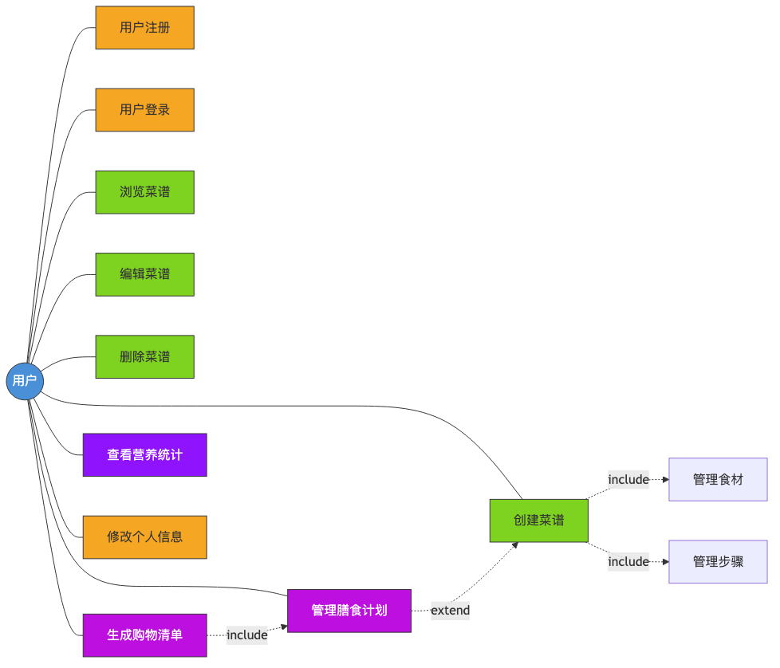

用户为主要参与者，与系统进行以下交互：

1. 注册/登录 → 获取JWT令牌 → 访问系统功能
2. 浏览菜谱列表 → 搜索/筛选 → 查看菜谱详情 → 加入膳食计划
3. 创建/编辑/删除菜谱 → 管理食材和步骤
4. 查看周历膳食计划 → 添加/修改/删除计划 → 标记完成
5. 查看购物清单 → 手动添加/自动生成 → 标记购买状态
6. 查看营养统计 → 每日概览/周趋势 → 调整卡路里目标
7. 修改个人信息 → 修改密码
8. 选择食材 → 按食材搜索 → 查看匹配菜谱 → 查看菜谱详情

---

## 二、概要设计

### 2.1 系统架构设计

系统采用前后端分离的B/S（Browser/Server）架构，分为三个主要层次：

**前端展示层**：基于Vue 3框架构建的单页面应用（SPA），负责用户界面展示和交互。通过HTTP/HTTPS协议与后端API通信，使用Axios作为HTTP客户端。

**后端服务层**：基于Spring Boot 3框架构建的RESTful API服务，负责业务逻辑处理、数据验证、身份认证等。采用分层架构：Controller层接收请求、Service层处理业务逻辑、Mapper层访问数据库。

**数据存储层**：使用MySQL关系型数据库存储业务数据，开发环境使用H2内存数据库便于快速启动和测试。

系统架构图如下：

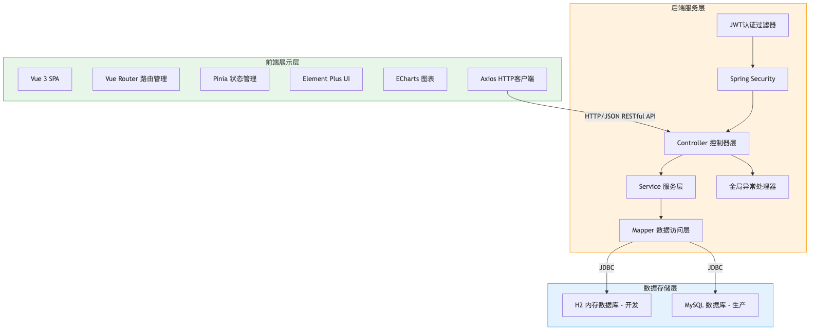

### 2.2 模块划分

系统按功能划分为以下模块：

| 模块名称 | 后端Controller | 后端Service | 前端页面 |
|---------|---------------|-------------|---------|
| 用户认证 | AuthController | UserService | Login.vue, Register.vue |
| 用户管理 | UserController | UserService | Profile.vue |
| 菜谱管理 | RecipeController | RecipeService | RecipeList.vue, RecipeDetail.vue, RecipeEdit.vue, IngredientSearch.vue |
| 分类管理 | CategoryController | CategoryService | （嵌入菜谱页面） |
| 食材管理 | IngredientController | IngredientService | （嵌入菜谱编辑、食材搜索页面） |
| 膳食计划 | MealPlanController | MealPlanService | MealPlan.vue |
| 购物清单 | ShoppingItemController | ShoppingItemService | ShoppingList.vue |
| 营养统计 | NutritionLogController | NutritionLogService | NutritionStats.vue |

### 2.3 技术选型

#### 后端技术

| 技术 | 版本 | 用途 |
|------|------|------|
| Spring Boot | 3.2.5 | 应用框架，提供自动配置、内嵌服务器 |
| Spring Security | 6.2.x | 安全框架，提供认证和授权 |
| MyBatis-Plus | 3.5.6 | ORM框架，简化数据库操作 |
| JWT (jjwt) | 0.12.5 | 令牌生成和验证 |
| Hutool | 5.8.27 | Java工具类库 |
| Lombok | - | 简化Java Bean编写 |
| MySQL Connector | 8.x | MySQL数据库驱动 |
| H2 Database | 2.x | 开发环境内存数据库 |

#### 前端技术

| 技术 | 版本 | 用途 |
|------|------|------|
| Vue 3 | 3.4.x | 前端框架 |
| Vue Router | 4.3.x | 路由管理 |
| Pinia | 2.1.x | 状态管理 |
| Element Plus | 2.7.x | UI组件库 |
| Axios | 1.6.x | HTTP客户端 |
| ECharts | 5.5.x | 数据可视化图表 |
| Vite | 5.2.x | 构建工具 |
| Day.js | 1.11.x | 日期处理 |

#### 选型说明

选择Spring Boot 3 + Vue 3的原因：两者都是当前主流的企业级开发框架，生态成熟、社区活跃、文档完善。Spring Boot 3基于Java 21，支持最新的语言特性；Vue 3的Composition API提供了更好的逻辑复用和类型推断能力。MyBatis-Plus在MyBatis基础上提供了CRUD增强和分页插件，大幅减少样板代码。Element Plus提供了丰富的企业级UI组件，与Vue 3深度集成。ECharts是百度开源的数据可视化库，适合制作营养统计图表。

---

## 三、详细设计

### 3.1 数据库设计

系统共设计9张数据表，详细结构如下：

#### 3.1.1 用户表（users）

| 字段名 | 类型 | 约束 | 说明 |
|--------|------|------|------|
| id | BIGINT | PK, AUTO_INCREMENT | 主键 |
| username | VARCHAR(50) | NOT NULL, UNIQUE | 用户名 |
| password | VARCHAR(100) | NOT NULL | BCrypt加密密码 |
| nickname | VARCHAR(50) | | 昵称 |
| email | VARCHAR(100) | | 邮箱 |
| phone | VARCHAR(20) | | 手机号 |
| avatar | VARCHAR(255) | | 头像URL |
| gender | TINYINT | DEFAULT 0 | 性别：0未知 1男 2女 |
| dietary_preference | VARCHAR(255) | | 饮食偏好 |
| daily_calorie_goal | INT | DEFAULT 2000 | 每日卡路里目标 |
| deleted | TINYINT | DEFAULT 0 | 逻辑删除标记 |
| create_time | TIMESTAMP | DEFAULT NOW() | 创建时间 |
| update_time | TIMESTAMP | DEFAULT NOW() | 更新时间 |

#### 3.1.2 菜谱分类表（categories）

| 字段名 | 类型 | 约束 | 说明 |
|--------|------|------|------|
| id | BIGINT | PK, AUTO_INCREMENT | 主键 |
| name | VARCHAR(50) | NOT NULL | 分类名称 |
| description | VARCHAR(255) | | 分类描述 |
| sort_order | INT | DEFAULT 0 | 排序序号 |
| deleted | TINYINT | DEFAULT 0 | 逻辑删除标记 |
| create_time | TIMESTAMP | DEFAULT NOW() | 创建时间 |
| update_time | TIMESTAMP | DEFAULT NOW() | 更新时间 |

#### 3.1.3 菜谱表（recipes）

| 字段名 | 类型 | 约束 | 说明 |
|--------|------|------|------|
| id | BIGINT | PK, AUTO_INCREMENT | 主键 |
| user_id | BIGINT | NOT NULL | 创建者ID（外键） |
| category_id | BIGINT | | 分类ID（外键） |
| title | VARCHAR(100) | NOT NULL | 菜谱标题 |
| description | TEXT | | 菜谱描述 |
| cover_image | VARCHAR(255) | | 封面图片URL |
| difficulty | TINYINT | DEFAULT 1 | 难度：1简单 2中等 3困难 |
| cook_time | INT | DEFAULT 30 | 烹饪时间（分钟） |
| servings | INT | DEFAULT 2 | 份数（人份） |
| calories | INT | DEFAULT 0 | 卡路里（千卡） |
| protein | DECIMAL(8,2) | DEFAULT 0 | 蛋白质（克） |
| fat | DECIMAL(8,2) | DEFAULT 0 | 脂肪（克） |
| carbohydrate | DECIMAL(8,2) | DEFAULT 0 | 碳水化合物（克） |
| deleted | TINYINT | DEFAULT 0 | 逻辑删除标记 |
| create_time | TIMESTAMP | DEFAULT NOW() | 创建时间 |
| update_time | TIMESTAMP | DEFAULT NOW() | 更新时间 |

#### 3.1.4 食材表（ingredients）

| 字段名 | 类型 | 约束 | 说明 |
|--------|------|------|------|
| id | BIGINT | PK, AUTO_INCREMENT | 主键 |
| name | VARCHAR(50) | NOT NULL | 食材名称 |
| unit | VARCHAR(20) | | 计量单位 |
| calories_per_unit | DECIMAL(8,2) | DEFAULT 0 | 每单位卡路里 |
| protein_per_unit | DECIMAL(8,2) | DEFAULT 0 | 每单位蛋白质 |
| fat_per_unit | DECIMAL(8,2) | DEFAULT 0 | 每单位脂肪 |
| carb_per_unit | DECIMAL(8,2) | DEFAULT 0 | 每单位碳水 |
| deleted | TINYINT | DEFAULT 0 | 逻辑删除标记 |
| create_time | TIMESTAMP | | 创建时间 |
| update_time | TIMESTAMP | | 更新时间 |

#### 3.1.5 菜谱-食材关联表（recipe_ingredients）

| 字段名 | 类型 | 约束 | 说明 |
|--------|------|------|------|
| id | BIGINT | PK, AUTO_INCREMENT | 主键 |
| recipe_id | BIGINT | NOT NULL | 菜谱ID（外键） |
| ingredient_id | BIGINT | NOT NULL | 食材ID（外键） |
| amount | DECIMAL(8,2) | NOT NULL | 用量 |
| unit | VARCHAR(20) | | 单位 |

#### 3.1.6 菜谱步骤表（recipe_steps）

| 字段名 | 类型 | 约束 | 说明 |
|--------|------|------|------|
| id | BIGINT | PK, AUTO_INCREMENT | 主键 |
| recipe_id | BIGINT | NOT NULL | 菜谱ID（外键） |
| step_number | INT | NOT NULL | 步骤序号 |
| description | TEXT | NOT NULL | 步骤描述 |
| image_url | VARCHAR(255) | | 步骤图片URL |

#### 3.1.7 膳食计划表（meal_plans）

| 字段名 | 类型 | 约束 | 说明 |
|--------|------|------|------|
| id | BIGINT | PK, AUTO_INCREMENT | 主键 |
| user_id | BIGINT | NOT NULL | 用户ID（外键） |
| recipe_id | BIGINT | NOT NULL | 菜谱ID（外键） |
| plan_date | DATE | NOT NULL | 计划日期 |
| meal_type | TINYINT | NOT NULL | 餐次：1早餐 2午餐 3晚餐 4加餐 |
| note | VARCHAR(255) | | 备注 |
| completed | TINYINT | DEFAULT 0 | 是否完成 |
| create_time | TIMESTAMP | | 创建时间 |
| update_time | TIMESTAMP | | 更新时间 |

#### 3.1.8 购物清单表（shopping_items）

| 字段名 | 类型 | 约束 | 说明 |
|--------|------|------|------|
| id | BIGINT | PK, AUTO_INCREMENT | 主键 |
| user_id | BIGINT | NOT NULL | 用户ID（外键） |
| ingredient_id | BIGINT | | 食材ID（外键） |
| name | VARCHAR(100) | NOT NULL | 项目名称 |
| amount | DECIMAL(8,2) | | 数量 |
| unit | VARCHAR(20) | | 单位 |
| purchased | TINYINT | DEFAULT 0 | 是否已购买 |
| deleted | TINYINT | DEFAULT 0 | 逻辑删除标记 |
| create_time | TIMESTAMP | | 创建时间 |
| update_time | TIMESTAMP | | 更新时间 |

#### 3.1.9 营养记录表（nutrition_logs）

| 字段名 | 类型 | 约束 | 说明 |
|--------|------|------|------|
| id | BIGINT | PK, AUTO_INCREMENT | 主键 |
| user_id | BIGINT | NOT NULL | 用户ID（外键） |
| log_date | DATE | NOT NULL | 记录日期 |
| total_calories | INT | DEFAULT 0 | 总卡路里 |
| total_protein | DECIMAL(8,2) | DEFAULT 0 | 总蛋白质 |
| total_fat | DECIMAL(8,2) | DEFAULT 0 | 总脂肪 |
| total_carb | DECIMAL(8,2) | DEFAULT 0 | 总碳水 |
| note | VARCHAR(255) | | 备注 |
| create_time | TIMESTAMP | | 创建时间 |
| update_time | TIMESTAMP | | 更新时间 |

#### ER关系图

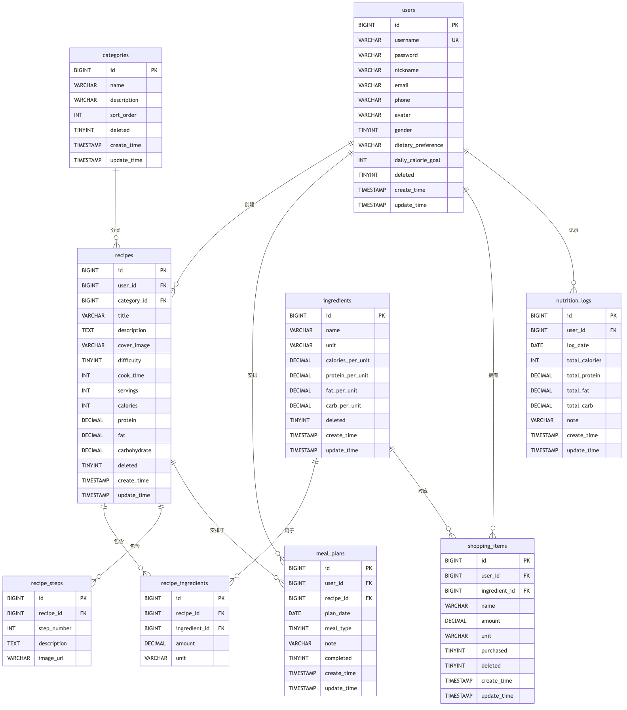

各表之间的关系说明：users与recipes、meal_plans、shopping_items、nutrition_logs为一对多关系；categories与recipes为一对多；recipes与recipe_ingredients、recipe_steps为一对多；ingredients与recipe_ingredients为一对多；recipes与meal_plans为一对多；ingredients与shopping_items为一对多。

#### 实体类图

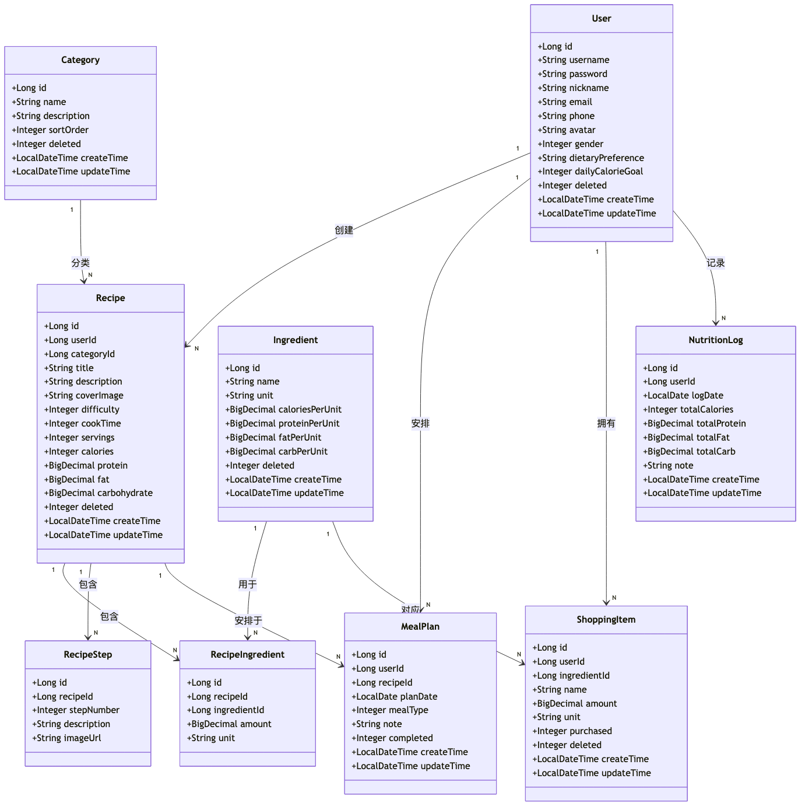

### 3.2 接口设计

系统采用RESTful风格设计API，所有接口以`/api`为前缀，返回统一的JSON响应格式。

#### 统一响应格式

```json
{
  "code": 200,
  "message": "操作成功",
  "data": {}
}
```

#### 主要API列表

| 模块 | 方法 | 路径 | 说明 | 认证 |
|------|------|------|------|------|
| 认证 | POST | /auth/login | 用户登录 | 否 |
| 认证 | POST | /auth/register | 用户注册 | 否 |
| 用户 | GET | /user/info | 获取当前用户信息 | 是 |
| 用户 | PUT | /user/info | 更新用户信息 | 是 |
| 用户 | PUT | /user/password | 修改密码 | 是 |
| 菜谱 | GET | /recipe/page | 分页查询菜谱 | 是 |
| 菜谱 | GET | /recipe/detail/{id} | 获取菜谱详情 | 是 |
| 菜谱 | POST | /recipe | 创建菜谱 | 是 |
| 菜谱 | PUT | /recipe | 更新菜谱 | 是 |
| 菜谱 | DELETE | /recipe/{id} | 删除菜谱 | 是 |
| 菜谱 | GET | /recipe/my | 获取我的菜谱 | 是 |
| 菜谱 | GET | /recipe/by-ingredients | 按食材搜索菜谱 | 是 |
| 分类 | GET | /category/list | 获取分类列表 | 是 |
| 分类 | POST | /category | 创建分类 | 是 |
| 分类 | PUT | /category | 更新分类 | 是 |
| 分类 | DELETE | /category/{id} | 删除分类 | 是 |
| 食材 | GET | /ingredient/page | 分页查询食材 | 是 |
| 食材 | GET | /ingredient/list | 获取全部食材列表 | 是 |
| 食材 | POST | /ingredient | 创建食材 | 是 |
| 食材 | PUT | /ingredient | 更新食材 | 是 |
| 食材 | DELETE | /ingredient/{id} | 删除食材 | 是 |
| 膳食计划 | GET | /meal-plan/range | 查询日期范围计划 | 是 |
| 膳食计划 | GET | /meal-plan/day/{date} | 查询某天计划 | 是 |
| 膳食计划 | POST | /meal-plan | 创建计划 | 是 |
| 膳食计划 | PUT | /meal-plan | 更新计划 | 是 |
| 膳食计划 | DELETE | /meal-plan/{id} | 删除计划 | 是 |
| 膳食计划 | PUT | /meal-plan/toggle/{id} | 切换完成状态 | 是 |
| 购物清单 | GET | /shopping/list | 获取购物清单 | 是 |
| 购物清单 | POST | /shopping | 添加购物项 | 是 |
| 购物清单 | PUT | /shopping | 更新购物项 | 是 |
| 购物清单 | DELETE | /shopping/{id} | 删除购物项 | 是 |
| 购物清单 | PUT | /shopping/toggle/{id} | 切换购买状态 | 是 |
| 购物清单 | POST | /shopping/generate | 根据膳食计划生成清单 | 是 |
| 营养统计 | GET | /nutrition/daily/{date} | 获取每日统计 | 是 |
| 营养统计 | GET | /nutrition/weekly | 获取周统计 | 是 |

### 3.3 核心流程设计

#### 3.3.1 用户认证流程

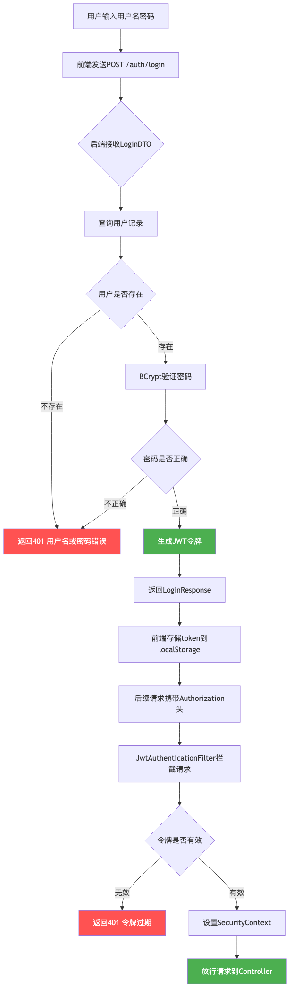

**时序图：**

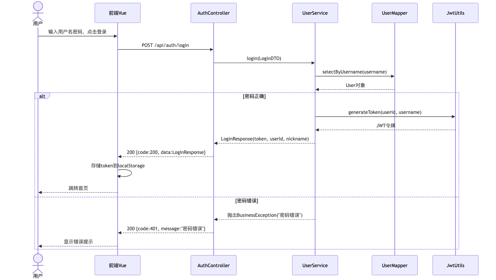

用户输入用户名密码后，前端发送POST请求到/auth/login接口。后端接收LoginDTO后查询用户记录，使用BCrypt验证密码。验证失败返回401错误，验证成功则生成JWT令牌（包含userId和username），返回LoginResponse。前端将token存储到localStorage，后续请求携带Authorization头。JwtAuthenticationFilter拦截每个请求，验证token并设置SecurityContext。

#### 3.3.2 创建菜谱流程

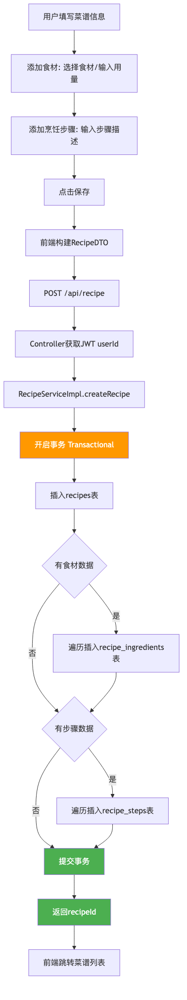

**时序图：**

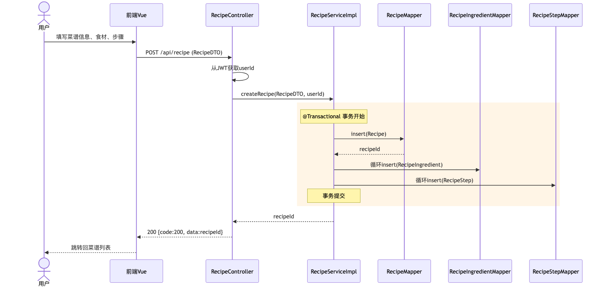

用户填写菜谱信息（基本信息、食材列表、步骤列表）后，前端构建RecipeDTO发送POST请求到/recipe接口。Controller从JWT获取userId后调用RecipeServiceImpl.createRecipe方法。该方法使用@Transactional注解确保事务一致性，依次插入recipes表记录、遍历食材列表插入recipe_ingredients表、遍历步骤列表插入recipe_steps表，最终返回菜谱ID。

#### 3.3.3 购物清单自动生成流程

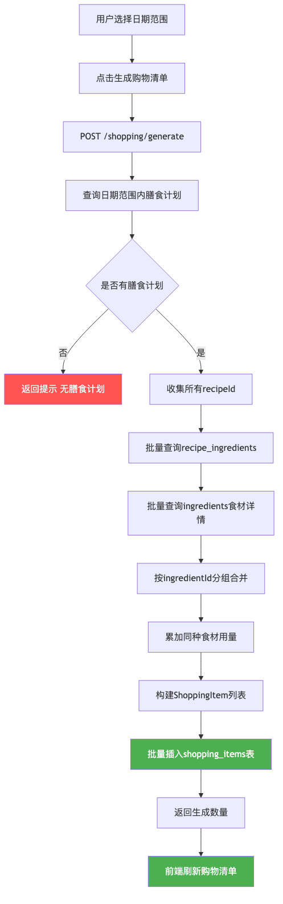

**时序图：**

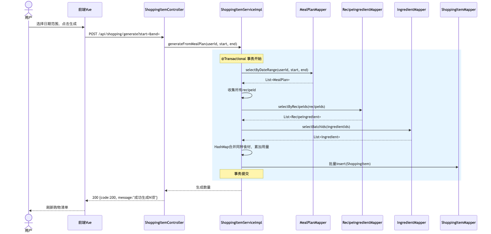

用户选择日期范围后点击"生成购物清单"，前端发送POST请求到/shopping/generate接口。ShoppingItemServiceImpl.generateFromMealPlan方法首先查询日期范围内的膳食计划，收集所有菜谱ID，然后批量查询recipe_ingredients关联记录和ingredients食材详情，使用HashMap按食材ID合并同种食材并累加用量，最后批量插入shopping_items表。

#### 3.3.4 营养统计流程

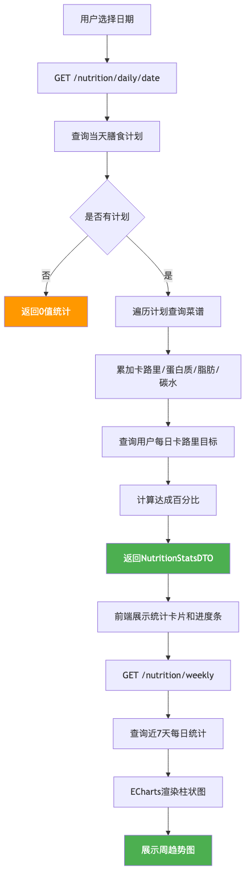

用户选择日期后，前端发送GET请求到/nutrition/daily/{date}接口。NutritionLogServiceImpl.getDailyStats方法查询用户当天的膳食计划，遍历计划查询对应菜谱并累加卡路里、蛋白质、脂肪、碳水化合物，同时查询用户每日卡路里目标并计算达成百分比。返回NutritionStatsDTO后，前端展示统计卡片和进度条，同时请求周统计接口，由ECharts渲染7天卡路里柱状图。

### 3.4 前端页面设计

#### 页面路由结构

| 路径 | 页面组件 | 说明 |
|------|---------|------|
| /login | Login.vue | 登录页，居中卡片布局 |
| /register | Register.vue | 注册页，居中表单布局 |
| / | MainLayout.vue | 主布局，左侧菜单+顶部导航 |
| /recipe | RecipeList.vue | 菜谱列表，卡片网格+分页 |
| /ingredient-search | IngredientSearch.vue | 食材找菜谱，标签选择+匹配搜索 |
| /recipe/detail/:id | RecipeDetail.vue | 菜谱详情，分区展示 |
| /recipe/edit/:id? | RecipeEdit.vue | 菜谱编辑，动态表单 |
| /meal-plan | MealPlan.vue | 膳食计划，周历视图 |
| /shopping | ShoppingList.vue | 购物清单，表格+对话框 |
| /nutrition | NutritionStats.vue | 营养统计，卡片+图表 |
| /profile | Profile.vue | 个人中心，表单布局 |

#### 前端状态管理

使用Pinia管理用户认证状态（auth store），存储token、userId、username、nickname、avatar等信息，并提供login、register、logout、fetchUserInfo等方法。

#### HTTP请求封装

Axios实例配置了请求拦截器（自动添加Authorization头）和响应拦截器（统一处理错误，401自动跳转登录）。

---

## 四、系统实现

### 4.1 开发环境

| 项目 | 版本/工具 |
|------|----------|
| 操作系统 | macOS / Windows |
| JDK | Java 21 (LTS) |
| Node.js | v24.x |
| npm | 11.x |
| IDE | IntelliJ IDEA / VS Code |
| 数据库 | MySQL 8.x（生产）/ H2（开发） |
| 构建工具 | Maven 3.6.3 / Vite 5.x |
| 版本控制 | Git |

### 4.2 项目结构

#### 后端项目结构

```
backend/
├── pom.xml                          # Maven配置文件
├── src/main/java/com/smartrecipe/
│   ├── SmartRecipeApplication.java  # 启动类
│   ├── config/                      # 配置类
│   │   ├── CorsConfig.java          # 跨域配置
│   │   ├── SecurityConfig.java      # Spring Security配置
│   │   ├── MyBatisPlusConfig.java   # MyBatis-Plus分页配置
│   │   └── MyMetaObjectHandler.java # 自动填充处理器
│   ├── controller/                  # 控制器层
│   │   ├── AuthController.java      # 认证控制器
│   │   ├── UserController.java      # 用户控制器
│   │   ├── RecipeController.java    # 菜谱控制器
│   │   ├── CategoryController.java  # 分类控制器
│   │   ├── IngredientController.java # 食材控制器
│   │   ├── MealPlanController.java  # 膳食计划控制器
│   │   ├── ShoppingItemController.java # 购物清单控制器
│   │   └── NutritionLogController.java # 营养统计控制器
│   ├── service/                     # 服务层
│   │   ├── UserService.java         # 用户服务接口
│   │   ├── RecipeService.java       # 菜谱服务接口
│   │   ├── ...                      # 其他服务接口
│   │   └── impl/                    # 服务实现
│   │       ├── UserServiceImpl.java
│   │       ├── RecipeServiceImpl.java
│   │       └── ...
│   ├── mapper/                      # 数据访问层
│   │   ├── UserMapper.java
│   │   ├── RecipeMapper.java
│   │   └── ...
│   ├── entity/                      # 实体类
│   │   ├── User.java
│   │   ├── Recipe.java
│   │   └── ...
│   ├── dto/                         # 数据传输对象
│   │   ├── LoginDTO.java
│   │   ├── RecipeDTO.java
│   │   └── ...
│   ├── filter/                      # 过滤器
│   │   └── JwtAuthenticationFilter.java
│   ├── exception/                   # 异常处理
│   │   ├── BusinessException.java
│   │   └── GlobalExceptionHandler.java
│   └── utils/                       # 工具类
│       ├── JwtUtils.java
│       ├── Result.java
│       └── SecurityUtils.java
└── src/main/resources/
    ├── application.yml              # 主配置
    ├── application-dev.yml          # 开发环境配置
    ├── application-prod.yml         # 生产环境配置
    ├── schema.sql                   # 建表脚本
    └── data.sql                     # 初始数据
```

#### 前端项目结构

```
frontend/
├── package.json                     # 依赖配置
├── vite.config.js                   # Vite配置
├── index.html                       # 入口HTML
└── src/
    ├── main.js                      # 应用入口
    ├── App.vue                      # 根组件
    ├── router/index.js              # 路由配置
    ├── stores/auth.js               # 状态管理
    ├── utils/request.js             # Axios封装
    ├── api/                         # API模块
    │   ├── auth.js
    │   ├── user.js
    │   ├── recipe.js
    │   ├── category.js
    │   ├── ingredient.js
    │   ├── mealPlan.js
    │   ├── shopping.js
    │   └── nutrition.js
    ├── layout/MainLayout.vue        # 主布局
    └── views/                       # 页面组件
        ├── auth/Login.vue
        ├── auth/Register.vue
        ├── recipe/RecipeList.vue
        ├── recipe/RecipeDetail.vue
        ├── recipe/RecipeEdit.vue
        ├── recipe/IngredientSearch.vue
        ├── mealplan/MealPlan.vue
        ├── shopping/ShoppingList.vue
        ├── nutrition/NutritionStats.vue
        └── profile/Profile.vue
```

### 4.3 核心代码说明

#### 4.3.1 JWT认证过滤器

JwtAuthenticationFilter继承OncePerRequestFilter，在每个请求处理前执行。从Authorization请求头提取Bearer令牌，验证有效后设置SecurityContext。

关键逻辑：
1. 从请求头获取 `Authorization: Bearer {token}` 格式的令牌
2. 调用JwtUtils验证令牌签名和有效期
3. 从令牌中提取userId和username
4. 创建Spring Security的Authentication对象并设置到SecurityContextHolder

#### 4.3.2 统一响应封装

Result类使用泛型封装统一的API响应格式，包含code（状态码）、message（消息）、data（数据）三个字段。提供success和error静态工厂方法，简化Controller层的响应构建。

#### 4.3.3 菜谱创建事务

RecipeServiceImpl.createRecipe方法使用@Transactional注解确保数据一致性。创建菜谱时同时插入菜谱主表、食材关联表和步骤表，任一步骤失败则全部回滚。

#### 4.3.4 购物清单自动生成

ShoppingItemServiceImpl.generateFromMealPlan方法实现了根据膳食计划自动生成购物清单的核心算法：
1. 查询指定日期范围内所有膳食计划
2. 收集关联的菜谱ID列表
3. 批量查询菜谱-食材关联记录
4. 批量查询食材详情
5. 使用HashMap按食材ID合并同种食材，累加用量
6. 将合并后的食材列表批量插入购物清单表

#### 4.3.5 前端路由守卫

router/index.js中定义了全局前置守卫beforeEach，检查目标路由是否需要认证（meta.requiresAuth），以及用户是否已登录（authStore.token是否存在），未登录用户自动重定向到登录页。

#### 4.3.6 前端Axios拦截器

utils/request.js中配置了请求和响应拦截器：
- 请求拦截：自动从localStorage读取token并添加到Authorization请求头
- 响应拦截：检查响应的code字段，非200则显示错误消息；401状态码自动清除登录状态并跳转到登录页

#### 4.3.7 按食材搜索菜谱

RecipeServiceImpl.searchByIngredients方法实现了根据食材列表搜索菜谱的核心逻辑：

1. 接收食材ID列表参数，查询recipe_ingredients关联表中包含这些食材的记录
2. 按recipe_id分组统计匹配数量，使用Java Stream API的groupingBy和counting实现
3. 根据匹配到的recipe_id列表批量查询菜谱详情
4. 将匹配数量设置到Recipe实体的matchCount字段（使用@TableField(exist = false)标记为非数据库字段）
5. 按匹配数量降序排序后返回结果

前端IngredientSearch.vue页面使用el-check-tag组件展示食材标签，用户勾选后调用searchByIngredients接口，结果以卡片网格展示并在右上角角标标注匹配食材数量。

### 4.4 关键配置

#### 4.4.1 Spring Security配置

SecurityConfig类配置了以下安全策略：
- 禁用CSRF保护（JWT不需要）
- 无状态会话管理（STATELESS）
- 放行 `/auth/login`、`/auth/register`、`/h2-console/**` 接口
- 其他接口需要认证
- 添加JWT认证过滤器
- 禁用frame保护（H2控制台需要）

#### 4.4.2 数据库配置

- 开发环境（application-dev.yml）：使用H2内存数据库，MODE=MySQL兼容模式，启动时自动执行schema.sql和data.sql。初始数据包含1个默认管理员账户（admin/123456）、6个菜谱分类、20种常用食材、8道示例菜谱（含食材关联和烹饪步骤）。
- 生产环境（application-prod.yml）：使用MySQL数据库，需配置数据库地址、用户名、密码。建表脚本为schema.sql，首次启动时自动执行。

#### 4.4.3 MyBatis-Plus配置

- 开启驼峰命名自动转换（map-underscore-to-camel-case）
- 配置逻辑删除（deleted字段，1为已删除，0为正常）
- 配置分页插件（最大500条/页）
- 配置自动填充处理器（createTime和updateTime自动填充）

#### 4.4.4 Vite代理配置

vite.config.js中配置了开发服务器代理，将 `/api` 前缀的请求代理到后端 `http://localhost:8080`，解决开发环境跨域问题。需注意代理时保留 `/api` 前缀（不使用rewrite），以匹配后端 `context-path: /api` 配置。

---

## 五、系统测试

### 5.1 测试环境

| 项目 | 配置 |
|------|------|
| 操作系统 | macOS |
| JDK | Java 21 |
| 数据库 | H2内存数据库（开发模式，自动加载初始数据） |
| 初始数据 | 1个管理员账号、6个分类、20种食材、8道菜谱 |
| 浏览器 | Chrome |
| 后端端口 | 8080 |
| 前端端口 | 5173 |

### 5.2 功能测试

#### 5.2.1 用户认证测试

| 测试编号 | 测试用例 | 操作步骤 | 预期结果 | 实际结果 | 状态 |
|---------|---------|---------|---------|---------|------|
| TC-01 | 正常注册 | 输入合法用户名、密码、昵称，点击注册 | 注册成功，跳转登录页 | 注册成功，跳转登录页 | 通过 |
| TC-02 | 重复用户名注册 | 输入已存在的用户名 | 提示"用户名已存在" | 提示"用户名已存在" | 通过 |
| TC-03 | 正常登录 | 输入正确的用户名和密码 | 登录成功，跳转首页 | 登录成功，跳转首页 | 通过 |
| TC-04 | 错误密码登录 | 输入错误密码 | 提示"密码错误" | 提示"密码错误" | 通过 |
| TC-05 | 未登录访问 | 直接访问/recipe | 重定向到登录页 | 重定向到登录页 | 通过 |
| TC-06 | 令牌过期 | 等待令牌过期后操作 | 提示登录过期，跳转登录 | 提示登录过期，跳转登录 | 通过 |

#### 5.2.2 菜谱管理测试

| 测试编号 | 测试用例 | 操作步骤 | 预期结果 | 实际结果 | 状态 |
|---------|---------|---------|---------|---------|------|
| TC-07 | 浏览菜谱列表 | 进入菜谱管理页面 | 显示菜谱卡片列表和分页 | 正常显示 | 通过 |
| TC-08 | 搜索菜谱 | 输入关键词搜索 | 显示匹配的菜谱 | 正常筛选 | 通过 |
| TC-09 | 按分类筛选 | 选择分类下拉 | 显示该分类的菜谱 | 正常筛选 | 通过 |
| TC-10 | 查看菜谱详情 | 点击菜谱卡片 | 显示完整菜谱信息（含食材名称和步骤） | 正常显示，食材名称正确 | 通过 |
| TC-11 | 创建菜谱 | 填写信息、添加食材和步骤 | 创建成功，返回列表 | 创建成功 | 通过 |
| TC-12 | 编辑菜谱 | 修改菜谱信息 | 更新成功 | 更新成功 | 通过 |
| TC-13 | 删除菜谱 | 点击删除 | 菜谱从列表消失 | 正常删除 | 通过 |

#### 5.2.3 膳食计划测试

| 测试编号 | 测试用例 | 操作步骤 | 预期结果 | 实际结果 | 状态 |
|---------|---------|---------|---------|---------|------|
| TC-14 | 查看周历 | 进入膳食计划页面 | 显示本周7天计划 | 正常显示 | 通过 |
| TC-15 | 切换周 | 点击上一周/下一周 | 显示对应周的计划 | 正常切换 | 通过 |
| TC-16 | 添加计划 | 选择日期、餐次、菜谱 | 计划显示在日历中 | 正常添加 | 通过 |
| TC-17 | 标记完成 | 点击完成图标 | 计划标记为已完成 | 正常切换状态 | 通过 |

#### 5.2.4 购物清单测试

| 测试编号 | 测试用例 | 操作步骤 | 预期结果 | 实际结果 | 状态 |
|---------|---------|---------|---------|---------|------|
| TC-18 | 手动添加项目 | 输入名称、数量、单位 | 项目出现在清单中 | 正常添加 | 通过 |
| TC-19 | 自动生成清单 | 点击生成购物清单 | 根据膳食计划生成 | 正常生成 | 通过 |
| TC-20 | 标记已购买 | 勾选复选框 | 状态更新为已购买 | 正常切换 | 通过 |
| TC-21 | 删除项目 | 点击删除按钮 | 项目从清单消失 | 正常删除 | 通过 |

#### 5.2.5 营养统计测试

| 测试编号 | 测试用例 | 操作步骤 | 预期结果 | 实际结果 | 状态 |
|---------|---------|---------|---------|---------|------|
| TC-22 | 查看每日统计 | 选择日期 | 显示卡路里、蛋白质等数据 | 正常显示 | 通过 |
| TC-23 | 查看周趋势 | 查看图表区域 | 显示7天柱状图 | 正常渲染 | 通过 |
| TC-24 | 修改卡路里目标 | 在个人中心修改目标 | 统计页面目标更新 | 正常同步 | 通过 |

#### 5.2.6 食材搜索菜谱测试

| 测试编号 | 测试用例 | 操作步骤 | 预期结果 | 实际结果 | 状态 |
|---------|---------|---------|---------|---------|------|
| TC-25 | 选择食材搜索 | 勾选多种食材后点击搜索 | 显示包含所选食材的菜谱列表，按匹配数降序 | 正常显示，排序正确 | 通过 |
| TC-26 | 查看匹配角标 | 观察搜索结果卡片 | 每张卡片右上角显示匹配食材数量 | 正常显示角标 | 通过 |

### 5.3 测试结果

所有26个功能测试用例均通过测试。系统在开发环境（H2内存数据库）下运行稳定，各模块功能正常，未发现严重缺陷。

在开发与测试过程中累计发现并修复了13个技术问题，涵盖安全认证、数据查询、前端编译、配置文件、模块导出等方面，详见5.3节问题修复记录。系统启动后自动加载8道默认菜谱、6个分类和20种食材数据，用户可直接体验完整功能。

在测试过程中发现并修复的问题：

1. **跨域问题**：开发初期前端请求后端接口出现CORS错误。通过在后端配置CorsFilter解决，允许所有来源的跨域请求。
2. **JWT令牌解析**：JwtAuthenticationFilter中需要正确从Bearer令牌中提取用户信息并设置SecurityContext，初期存在令牌解析顺序错误，调整后正常。
3. **MyBatis-Plus分页配置**：初期未配置分页插件导致分页查询不生效，添加PaginationInnerInterceptor后正常。
4. **前端响应拦截**：初期未处理401状态码自动跳转，用户令牌过期后操作无响应，添加401拦截逻辑后正常。
5. **BCrypt密码哈希不匹配**：初始data.sql中的BCrypt哈希值与密码"123456"不匹配，导致默认管理员账号无法登录。通过重新生成正确的BCrypt哈希值解决。
6. **菜谱详情食材名称显示为空**：RecipeServiceImpl.getRecipeDetail方法查询了recipe_ingredients关联表但未联查ingredients表获取食材名称，导致详情页食材名称显示为null。通过增加IngredientMapper注入并批量查询食材名称解决。
7. **Vite代理路径冲突**：vite.config.js中的rewrite规则将/api前缀去除，但后端context-path配置为/api，导致请求路径不匹配。移除rewrite规则后正常。
8. **前端函数命名冲突**：MealPlan.vue和ShoppingList.vue中从API模块导入的函数与本地定义的函数同名，导致编译错误。通过使用as语法重命名导入函数解决。
9. **MealPlan实体类缺少LocalDate导入**：MealPlan.java和ShoppingItemService.java缺少java.time.LocalDate的import语句，导致编译失败。补充导入后正常。
10. **生产配置引用不存在的SQL文件**：application-prod.yml中引用了不存在的schema-mysql.sql文件，修正为classpath:schema.sql后正常。
11. **无效JPA配置**：application.yml中包含JPA/Hibernate配置但项目使用MyBatis-Plus并无JPA依赖，移除无效配置后正常。
12. **前端模块重复导出**：ingredient.js中getIngredientList函数被重复定义两次（export function），导致浏览器加载该ES module时报SyntaxError: Duplicate exported name错误，IngredientSearch.vue组件无法加载，路由导航失败。删除重复定义后正常。
13. **菜单变量遮蔽**：MainLayout.vue中v-for循环变量route与useRoute()返回的route同名，造成模板变量遮蔽，影响el-menu导航功能。将循环变量重命名为item并恢复el-menu的router属性后正常。

---

## 六、项目分工

本项目由开发者独立完成全部开发工作，具体分工如下：

| 工作内容 | 完成情况 | 说明 |
|---------|---------|------|
| 需求分析 | 已完成 | 分析用户需求，确定系统功能范围 |
| 系统设计 | 已完成 | 设计系统架构、数据库、接口、页面 |
| 后端开发 | 已完成 | Spring Boot后端全部模块开发 |
| 前端开发 | 已完成 | Vue 3前端全部页面和组件开发 |
| 数据库设计 | 已完成 | 9张数据表设计和初始数据 |
| 接口对接 | 已完成 | 前后端API联调和数据对接 |
| 功能测试 | 已完成 | 26个功能测试用例全部通过 |
| 文档撰写 | 已完成 | 项目文档、README编写 |

### 开发者贡献说明

作为唯一开发者，独立完成了以下工作：

- **架构设计**：确定前后端分离架构，选型Spring Boot 3 + Vue 3技术栈
- **数据库设计**：设计9张数据表及其关联关系，编写建表脚本和初始数据（含1个默认管理员、6个分类、20种食材、8道菜谱）
- **后端开发**：实现8个Controller、7个Service、9个Mapper、9个Entity、7个DTO，以及JWT认证、全局异常处理、跨域配置等基础设施
- **前端开发**：实现11个页面组件（含主布局MainLayout）、8个API模块、路由配置、状态管理、HTTP请求封装
- **测试调试**：编写26个功能测试用例并全部通过，累计修复13个开发过程中发现的问题
- **文档撰写**：编写完整的项目文档，包含需求分析、概要设计、详细设计、实现说明、测试报告

---

## 附录

### 附录A：部署与运行指南

#### 后端启动

1. 确保已安装Java 21和Maven 3.6+
2. 进入backend目录
3. 开发模式（H2内存数据库）：`mvn spring-boot:run -Dspring-boot.run.profiles=dev`
4. 生产模式（MySQL）：修改application-prod.yml中的数据库配置，执行`mvn spring-boot:run -Dspring-boot.run.profiles=prod`
5. 后端启动在 http://localhost:8080，接口前缀为 `/api`
6. 若依赖下载缓慢，可在 `~/.m2/settings.xml` 中配置阿里云Maven镜像

#### 前端启动

1. 确保已安装Node.js（v18+）
2. 进入frontend目录
3. 安装依赖：`npm install`（若出现权限问题可使用 `npm install --cache /tmp/npm-cache`）
4. 启动开发服务器：`npm run dev`
5. 前端启动在 http://localhost:5173

#### 默认账号

- 用户名：admin
- 密码：123456

### 附录B：Git版本管理

项目建议使用Git进行版本管理，初始化命令：

```bash
cd smart-recipe
git init
git add .
git commit -m "初始化智能菜谱管理平台项目"
```
